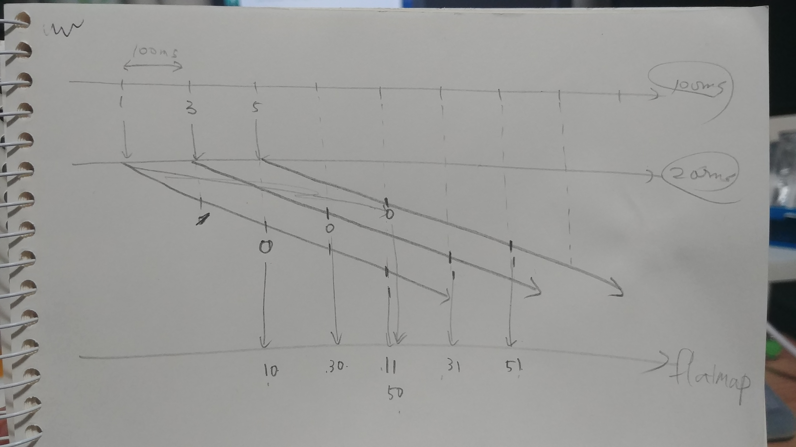

# 변환연산자

변환연산자는 데이터의 흐름을 원하는 대로 변형할 수 있는 연산자로 **concatMap(), switchMap(), scan(), groupBy()** 가 있다.


## concatMap()

> - flatMap()과 비슷한 함수
> - flatMap()과는 다르게 들어온 **데이터들의 순서를 보장**해준다.


## switchMap()

> - flatMap(), concatMap()과는 다르게 새로운 데이터가 들어오면 **기존에 진행중이던 작업은 중지시키고 새로 시작**한다.
> - 센서 등의 값을 얻어와서 동적으로 처리하는 경우에 유용하다.


### Code 비교

```java
Utils.setStartTime();

String[] list = {"1", "3", "5"};
Observable.interval(100, TimeUnit.MILLISECONDS)
  .map(emit -> emit.intValue())
  .map(index -> list[index])
  .take(3) // flatMap(), concatMap(), switchMap()으로 각각 변경
  .concatMap(listItem -> Observable.interval(200, TimeUnit.MILLISECONDS)
             .map(emit -> listItem + "-" + emit)
             .take(2))
  .subscribe(result -> Utils.log_i("result: " + result));

Utils.sleep(5000);
```

```java
// Output
// 1. flatMap()
Thread[RxComputationThreadPool-2,5,main] | 795ms | result: 1-0
Thread[RxComputationThreadPool-3,5,main] | 894ms | result: 3-0
Thread[RxComputationThreadPool-2,5,main] | 996ms | result: 1-1
Thread[RxComputationThreadPool-4,5,main] | 998ms | result: 5-0
Thread[RxComputationThreadPool-3,5,main] | 1095ms | result: 3-1
Thread[RxComputationThreadPool-4,5,main] | 1195ms | result: 5-1
  
// 2. concatMap()
Thread[RxComputationThreadPool-2,5,main] | 609ms | result: 1-0
Thread[RxComputationThreadPool-2,5,main] | 809ms | result: 1-1
Thread[RxComputationThreadPool-3,5,main] | 1009ms | result: 3-0
Thread[RxComputationThreadPool-3,5,main] | 1209ms | result: 3-1
Thread[RxComputationThreadPool-4,5,main] | 1410ms | result: 5-0
Thread[RxComputationThreadPool-4,5,main] | 1610ms | result: 5-1

// 3. switchMap()
Thread[RxComputationThreadPool-4,5,main] | 1037ms | result: 5-0
Thread[RxComputationThreadPool-4,5,main] | 1237ms | result: 5-1
```

> concatMap()이 순서를 보장하여 데이터를 내보내는 반면, flatMap()은 아래 사진처럼 순서를 보장하지 못하고 오는 순서대로 그때그때 맞는 데이터를 내보낸다. switchMap()은 2번쨰 Observable이 시작하기전에 1번째 Observable에서 데이터가 계속 발행되기 때문에 마지막 "5"번에 해당하는 값만 출력된다.




## groupBy()

> - groupBy()는 keySelector를 기준으로 그룹을 형성해주는 함수이다.
> - 그룹으로 맺어진 Observable은 **GroupedObservable**형태로 출력되어 key값과 각 Observable의 값들을 받을 수 있다.


```java
public static void main(String args[]) {
  String[] list = {"6", "4", "2-T", "2", "6-T", "4-T"};
  Observable<GroupedObservable<String, String>> source = Observable.fromArray(list)
    .groupBy(listItem -> getShape(listItem));
  source.subscribe(go -> go.subscribe(goItem -> Utils.print("GROUP: " + go.getKey() + "| VALUE: " + goItem)));
}

private static String getShape(String item) {
  if (item.endsWith("-H")) return "HEXAGON";
  if (item.endsWith("-O")) return "OCTAGON";
  if (item.endsWith("-R")) return "RECTANGLE";
  if (item.endsWith("-T")) return "TRIANGLE";
  return "BALL";
}
```

```java
// Output
GROUP: BALL		| VALUE: 6
GROUP: BALL		| VALUE: 4
GROUP: TRIANGLE	| VALUE: 2-T
GROUP: BALL		| VALUE: 2
GROUP: TRIANGLE	| VALUE: 6-T
GROUP: TRIANGLE	| VALUE: 4-T
```


## scan()

> - reduce()와 거의 동일한 함수
> - **reduce()와는 다르게 중간값을 계속 발행**하는 Observable형태를 띤다.


```java
String[] balls = {"1", "3", "5"};

// scan()은 중간 데이터를 계속 발행하기 때문에
// Observable 클래스 타입으로 리턴된다.
Observable<String> source = Observable.fromArray(balls)
  .scan((ball1, ball2) -> ball2 + "(" + ball1 + ")");
source.subscribe(System.out::println);
```

```java
//Output
1
3(1)
5(3(1))
```

> - reduce()
>   - **최종 결과값 1개만 출력되므로 return type은 Maybe이다.**
>   - 발행되는 데이터들의 총 합산값을 계산할때 사용한다.
> - scan()
>   - **중간 결과값을 계속 출력하므로 return type은 Observable이다.**
>   - 발행되는 데이터들의 누적값을 계산할때 사용한다.

